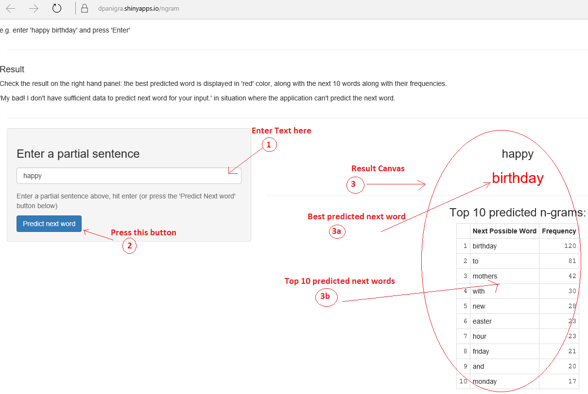

## Overview

The n-gram predictor application is hosted in Shinyapps [@Shinyapps](https://dpanigra.shinyapps.io/ngram/)

The application:
- Asks to enter a partial sentence
- Displays the best predicted next possible word
- Displays the top 10 next possible words along with their requency of presence in the data set

Constraints:
- The application uses only 13% of the News, Twitter, and, Blog of English data set from [HC Corpora Data](http://d396qusza40orc.cloudfront.net/dsscapstone/dataset/Coursera-SwiftKey.zip) to run efficiently with smaller devices with small memory footprint and ShinyApps caps the size at 100Mb.

---
## User Manual
Follow the steps in order mentioned by numbered red circle:

---
## Data Structure, Algorithm, and procedure Used
- VCorpus and TermDocumentMatrix Data Structures are used to help create the n-grams.
- Weka is used to create the different n-grams (bi-, tri-, quad-, and, penta-grams)
- The n-grams created in above step are stored in a SQLite database.
- "Stupid Backoff" ([Brants et al 2007](http://www.cs.columbia.edu/~smaskey/CS6998-0412/supportmaterial/langmodel_mapreduce.pdf)) is used 
- SQLite database created above, along with the 'Stupid Backoff' algorithm, is used by the Shiny application to find the best predicted words 

---
## Next steps
- Consider an infrastructure to waive the current limiation of 100Mb imposed by shinyapp
- Consider to go beyond penta-grams
- Consider the performance challenges to handle large data set
  - consider using parallel processing
  - consider using multiple cores in the R-runtime
- Consider removing the 'Predict next word' button
  - Consider using autofiller

